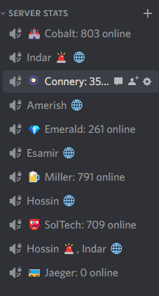

# Medkit2

A re-imagining of https://github.com/kayteh/medkit-bot

Currently it changes some channel names in Discord based on server pop, continents and alerts, as seen below.

## Upstream APIs in use

- [PS2 Census API](https://census.daybreakgames.com/) (alerts, continent locks, event data)
- [Voidwell](https://voidwell.com) (population)
- [ps2.fisu.pw](https://ps2.fisu.pw) (population)
- [wt.honu.pw](https://wt.honu.pw) (population)

## Developing

- Have node & yarn
- Run `yarn install`
- Run `yarn start`. It'll generally work.
- Want it to really work? Add a `[vars]` to wrangler.toml named `BOT_TOKEN`, or set it as a secret through Wrangler.
- Deploy with `yarn wrangler publish`.

## Design Docs

### Population

[See code](./src/population.ts)

Pulls data from 3 reliable sources (Voidwell, fisu, and honu) and averages them due to inconsistencies. Usually one outlier exists, so this smooths the curve. Get raw outputs with `/x/debug-populations/<serverID>`.

If any one API fails, it's removed from the count.

### Continent Locks

[See code](./src/locks.ts)

Pulls entire map state from Census, filters down to all 3 warpgates for a given continent, and checks if they're all the same owner. E.g. a TR-locked Indar will have `2201`, `2202`, and `2203` with a TR faction ID.

This may not always keep up with the actual map (like Esamir), so a potential for codegen arises if APIs stablize :)

### Alerts

[See code](./src/alerts.ts)

Pulls world_events with type `METAGAME` from Census API; distinctly not joining with the metagame_events table. Instead, we codegen the known alert types, Conquest, Max, and Air, by their metagame_events type via [codegen](./hack/codegen-metagame.js). Both of these considerations are due to Census API missing Oshur data.

Census will report alerts in the order they both started and ended, we build an array of active events, and remove them when the `instance_id` matches another that ended.
